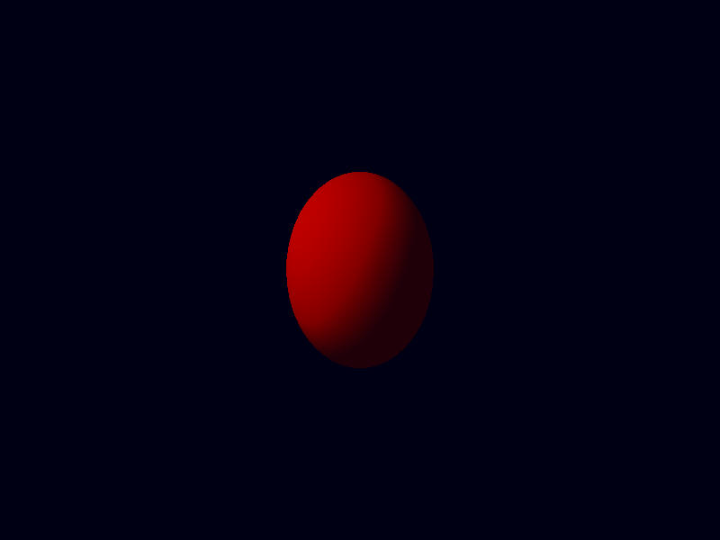

## Ashen Aetna 
#### — Rustily stumbling around on an ash-covered volcano 
###### (A tutorial on/in/about/with 3D graphics, Rust, Vulkan, ash)

# Screenshots

We're certainly not done with shading and there are some topics that are more fundamental and have not been covered yet, 
but I really want to have a way to take screenshots, so we're trying to add the possibility to take screenshots to our program, this chapter. 

(Yes, there is a screenshot program installed on my computer. But that's not the same as having the own program save its screens, is it?) 

So: Screenshots. What do we need? 

At the end of the graphics pipeline, we write all the colours in some framebuffer/image and then present it on the screen. We cannot directly read the
data from this image. We need a way to copy it to another image that we can read from the application and finally save in a file. 

We'll do it in small steps. 
```rust
                    winit::event::VirtualKeyCode::F12 => {
                        println!("screenshot");
                    }
```
That step is a bit too small. 
```rust
                    winit::event::VirtualKeyCode::F12 => {
                        println!("screenshot");
                        screenshot(&aetna).expect("screenshot trouble");
                    }
```
Better. This goes along with the function in which we are going to work now:
```rust
fn screenshot(aetna: &Aetna) -> Result<(), Box<dyn std::error::Error>> {
	Ok(())
}
```
It returns a `Result`, as there will be several function calls that could fail.

Whatever it exactly is that we're going to do in this function, it will consist of sending instructions to the GPU, main among those some "copy this
image" (... into some variable that we can use in our program and save as a screenshot). For sending instructions, we will need a command buffer;
let's create one: 
```rust
    let commandbuf_allocate_info = vk::CommandBufferAllocateInfo::builder()
        .command_pool(aetna.pools.commandpool_graphics)
        .command_buffer_count(1);
    let copybuffer = unsafe {
        aetna
            .device
            .allocate_command_buffers(&commandbuf_allocate_info)
    }
    .unwrap()[0];

    let cmdbegininfo =
        vk::CommandBufferBeginInfo::builder().flags(vk::CommandBufferUsageFlags::ONE_TIME_SUBMIT);
    unsafe { aetna.device.begin_command_buffer(copybuffer, &cmdbegininfo) }?;
```
Once again, we will be concerned with images, and use the queue family for graphics (and the corresponding command pool), and we need one command
buffer. We create it (noting that `.allocate_command_buffers` is meant to create several command buffers at the same time, although we only need one),
and then we begin the recording of commands for this command buffer. (For the creation, we could also use an earlier function; but it seems short
enough.) 

In the `CommandBufferBeginInfo` we set a flag saying that we only want to submit this buffer once. 

Next, we need an image. This image should be accessible from the CPU (in `AllocationCreateInfo` we use `MemoryUsage::GpuToCpu`), as that is the main
point of its creation. 

It should also be able to serve as destination for a transfer (actually: copy) operation, which is what we announce as `.usage`. 
```rust
    let ici = vk::ImageCreateInfo::builder()
        .format(vk::Format::R8G8B8A8_UNORM)
        .image_type(vk::ImageType::TYPE_2D)
        .extent(vk::Extent3D {
            width: aetna.swapchain.extent.width,
            height: aetna.swapchain.extent.height,
            depth: 1,
        })
        .array_layers(1)
        .mip_levels(1)
        .samples(vk::SampleCountFlags::TYPE_1)
        .tiling(vk::ImageTiling::LINEAR)
        .usage(vk::ImageUsageFlags::TRANSFER_DST)
        .initial_layout(vk::ImageLayout::UNDEFINED);

    let allocinfo = vk_mem::AllocationCreateInfo {
        usage: vk_mem::MemoryUsage::GpuToCpu,
        ..Default::default()
    };
    let (destination_image, dst_alloc, _allocinfo) =
        aetna.allocator.create_image(&ici, &allocinfo)?;
```
Upon creation, this new image has an `UNDEFINED` layout. We want it to have a memory layout that is suitable for the image to be the destination of a
transfer operation. (And no, the latter is not a layout we could choose in the `ImageCreateInfo`.) 

The way to change this layout is to set an `ImageMemoryBarrier`, a synchronisation command controlling access to images and useful for a layout
transition. We need the old and new layout, the image (and the subresource range with no interesting settings), access masks (what operations do we want to have performed before and after the transition) and the pipeline stages between which
this transition should occur (the latter are already part of the arguments for `cmd_pipeline_barrier`):

```rust
    let barrier = vk::ImageMemoryBarrier::builder()
        .image(destination_image)
        .src_access_mask(vk::AccessFlags::empty())
        .dst_access_mask(vk::AccessFlags::TRANSFER_WRITE)
        .old_layout(vk::ImageLayout::UNDEFINED)
        .new_layout(vk::ImageLayout::TRANSFER_DST_OPTIMAL)
        .subresource_range(vk::ImageSubresourceRange {
            aspect_mask: vk::ImageAspectFlags::COLOR,
            base_mip_level: 0,
            level_count: 1,
            base_array_layer: 0,
            layer_count: 1,
        })
        .build();
    unsafe {
        aetna.device.cmd_pipeline_barrier(
            copybuffer,
            vk::PipelineStageFlags::TRANSFER,
            vk::PipelineStageFlags::TRANSFER,
            vk::DependencyFlags::empty(),
            &[],
            &[],
            &[barrier],
        )
    };
```
After that, `destination_image` is ready to receive a picture from a copy command. 

But the image from which we want to copy (one of the swapchain images) has the wrong layout. We instigate a similar layout transition so as to make it a suitable source for a transfer (`ImageLayout::TRANSFER_SRC_OPTIMAL`): 
```rust
    let source_image = aetna.swapchain.images[aetna.swapchain.current_image];
    let barrier = vk::ImageMemoryBarrier::builder()
        .image(source_image)
        .src_access_mask(vk::AccessFlags::MEMORY_READ)
        .dst_access_mask(vk::AccessFlags::TRANSFER_READ)
        .old_layout(vk::ImageLayout::PRESENT_SRC_KHR)
        .new_layout(vk::ImageLayout::TRANSFER_SRC_OPTIMAL)
        .subresource_range(vk::ImageSubresourceRange {
            aspect_mask: vk::ImageAspectFlags::COLOR,
            base_mip_level: 0,
            level_count: 1,
            base_array_layer: 0,
            layer_count: 1,
        })
        .build();
    unsafe {
        aetna.device.cmd_pipeline_barrier(
            copybuffer,
            vk::PipelineStageFlags::TRANSFER,
            vk::PipelineStageFlags::TRANSFER,
            vk::DependencyFlags::empty(),
            &[],
            &[],
            &[barrier],
        )
    };
```
This is something the validation layers would rightly complain about. When we created this image, we never said that we would ever want to use it as
source for a data transfer. (Of course not: At that time we didn't know.) 

But we can correct that: In `swapchain.rs`, where we define `swapchain_create_info`, we make sure to adjust the line about `usage` to 
```rust 
            .image_usage(vk::ImageUsageFlags::COLOR_ATTACHMENT | vk::ImageUsageFlags::TRANSFER_SRC) 
```

Anyways: With the layout transitions completed, we can use a copy command. Of course (it's Vulkan!): Using a command to copy means we first have to
write more detailled instructions what we want to copy.  
```rust
    let zero_offset = vk::Offset3D::default();
    let copy_area = vk::ImageCopy::builder()
        .src_subresource(vk::ImageSubresourceLayers {
            aspect_mask: vk::ImageAspectFlags::COLOR,
            mip_level: 0,
            base_array_layer: 0,
            layer_count: 1,
        })
        .src_offset(zero_offset)
        .dst_subresource(vk::ImageSubresourceLayers {
            aspect_mask: vk::ImageAspectFlags::COLOR,
            mip_level: 0,
            base_array_layer: 0,
            layer_count: 1,
        })
        .dst_offset(zero_offset)
        .extent(vk::Extent3D {
            width: aetna.swapchain.extent.width,
            height: aetna.swapchain.extent.height,
            depth: 1,
        })
        .build();
```
And then we can copy: 
```rust
    unsafe {
        aetna.device.cmd_copy_image(
            copybuffer,
            source_image,
            vk::ImageLayout::TRANSFER_SRC_OPTIMAL,
            destination_image,
            vk::ImageLayout::TRANSFER_DST_OPTIMAL,
            &[copy_area],
        )
    };
```
Afterwards, we want to read the data from `destination_image`, and therefore yet again need it in another image layout. Hence: Another image memory
barrier:
```rust
    let barrier = vk::ImageMemoryBarrier::builder()
        .image(destination_image)
        .src_access_mask(vk::AccessFlags::TRANSFER_WRITE)
        .dst_access_mask(vk::AccessFlags::MEMORY_READ)
        .old_layout(vk::ImageLayout::TRANSFER_DST_OPTIMAL)
        .new_layout(vk::ImageLayout::GENERAL)
        .subresource_range(vk::ImageSubresourceRange {
            aspect_mask: vk::ImageAspectFlags::COLOR,
            base_mip_level: 0,
            level_count: 1,
            base_array_layer: 0,
            layer_count: 1,
        })
        .build();
    unsafe {
        aetna.device.cmd_pipeline_barrier(
            copybuffer,
            vk::PipelineStageFlags::TRANSFER,
            vk::PipelineStageFlags::TRANSFER,
            vk::DependencyFlags::empty(),
            &[],
            &[],
            &[barrier],
        )
    };
```
And also the `source_image` should be returned to the layout it is supposed to have: 
```rust
    let barrier = vk::ImageMemoryBarrier::builder()
        .image(source_image)
        .src_access_mask(vk::AccessFlags::TRANSFER_READ)
        .dst_access_mask(vk::AccessFlags::MEMORY_READ)
        .old_layout(vk::ImageLayout::TRANSFER_SRC_OPTIMAL)
        .new_layout(vk::ImageLayout::PRESENT_SRC_KHR)
        .subresource_range(vk::ImageSubresourceRange {
            aspect_mask: vk::ImageAspectFlags::COLOR,
            base_mip_level: 0,
            level_count: 1,
            base_array_layer: 0,
            layer_count: 1,
        })
        .build();
    unsafe {
        aetna.device.cmd_pipeline_barrier(
            copybuffer,
            vk::PipelineStageFlags::TRANSFER,
            vk::PipelineStageFlags::TRANSFER,
            vk::DependencyFlags::empty(),
            &[],
            &[],
            &[barrier],
        )
    };
```
That's what we have to do on the GPU side. We still haven't read the information from `destination_image`, but (remember which kind of memory usage we chose for that image!) this is accessible from the CPU. 

In other words: We are done with the commands for the GPU: 
```rust
    unsafe { aetna.device.end_command_buffer(copybuffer) }?;
```
We must then submit this command buffer. And before we then try to read `destination_image`, we should also *wait* until all of the above has
happened. (Up to now, it's only on our wishlist of what should happen.) 

For this waiting, we create a fence.

Then we submit the command buffer: 
```rust
    let submit_infos = [vk::SubmitInfo::builder()
        .command_buffers(&[copybuffer])
        .build()];
    let fence = unsafe {
        aetna
            .device
            .create_fence(&vk::FenceCreateInfo::default(), None)
    }?;
    unsafe {
        aetna
            .device
            .queue_submit(aetna.queues.graphics_queue, &submit_infos, fence)
    }?;
```
and wait:
```rust
    unsafe { aetna.device.wait_for_fences(&[fence], true, std::u64::MAX) }?;
```
And since we don't need command buffer or fence any longer, let's clean up: 
```rust
    unsafe { aetna.device.destroy_fence(fence, None) };
    unsafe {
        aetna
            .device
            .free_command_buffers(aetna.pools.commandpool_graphics, &[copybuffer])
    };
```
Next goal: Get the data out of the image into, say, a `Vec::<u8>`. 

First, we make sure that we can access the memory by `map`ping it
```rust
    let source_ptr = aetna.allocator.map_memory(&dst_alloc)? as *mut u8;
```
Then we want to copy these bytes, but how large should the vector be? 

Let's ask:
```rust
    let subresource_layout = unsafe {
        aetna.device.get_image_subresource_layout(
            destination_image,
            vk::ImageSubresource {
                aspect_mask: vk::ImageAspectFlags::COLOR,
                mip_level: 0,
                array_layer: 0,
            },
        )
    };
```
Then `subresource_layout.size` tells us the size in bytes; `subresource_layout` also contains the number of bytes between different rows etc. 

Time to get our hands on the data: We create a vector and copy it:
```rust 
    let mut data = Vec::<u8>::with_capacity(subresource_layout.size as usize);
    unsafe {
        std::ptr::copy(
            source_ptr,
            data.as_mut_ptr(),
            subresource_layout.size as usize,
        );
        data.set_len(subresource_layout.size as usize);
    }
```
(Since the copying happens via some pointers, we're in `unsafe` territory here, and set the length of `data` manually.) 

Let's have a look at what we got:
```rust
    dbg!(&data[0..20]);
```
(Better not the whole vector - that would be too long...) 
```
[src/main.rs:387] &data[0..20] = [
    20,
    0,
    0,
    255,
    20,
    0,
    0,
    255,
    20,
    0,
    0,
    255,
    20,
    0,
    0,
    255,
    20,
    0,
    0,
    255,
]
```
Okay: in the corner of the window we should see the background, not the sphere, and indeed: the values `[20,0,0,255]` repeat, all pixels have the same
colour. 

If we consult `Aetna`'s `update_commandbuffer` function, we find 
```rust
vk::ClearValue {
                color: vk::ClearColorValue {
                    float32: [0.0, 0.0, 0.08, 1.0],
                },
            },
```
and translating the float values to the `u8` range of `0` to `255`, this clear colour corresponds to `[0,0,20,255]`. That looks right — apart from the
order. What our `Vec<u8>` contains is BGRA, not RGBA. But hadn't we said 
```rust
        .format(vk::Format::R8G8B8A8_UNORM)
```
in our `ImageCreateInfo` for `destination_image`? We had. But the source image had `Format::B8G8R8A8`, and the layout transitions and `cmd_copy_image`
do not translate the colour format. 

We don't need the image any longer, so: cleanup again: unmapping the memory and destroying the image: 
```rust
    aetna.allocator.unmap_memory(&dst_alloc)?;
    aetna
        .allocator
        .destroy_image(destination_image, &dst_alloc)?;
```
Final step: How do we turn our vector of `u8`s into a saved screenshot? We could probably dump the values into a file (together with a small header)
and almost directly have a .bmp file; but let us use a crate for images:

A new dependency for `Cargo.toml`: 
```rust
image = "0.23.4"
```
We turn our vector into an `ImageBuffer`. We make sure to use a `BGRA` format:
```rust
       let screen: image::ImageBuffer<image::Bgra<u8>, _> = image::ImageBuffer::from_raw(
            aetna.swapchain.extent.width,
            aetna.swapchain.extent.height,
            data,
        )
        .expect("ImageBuffer creation");
```
Saving images is not directly supported for BGRA images, but we can easily transform the image to RGBA, and then saving it is a very short command: 
```rust
        let screen_image = image::DynamicImage::ImageBgra8(screen).to_rgba();
        screen_image.save("screenshot.jpg")?;
   ``` 

And: 



Now we can have screenshots as illustrations, it seems.

Finally, the screenshot function in total:
```rust
fn screenshot(aetna: &Aetna) -> Result<(), Box<dyn std::error::Error>> {
    let commandbuf_allocate_info = vk::CommandBufferAllocateInfo::builder()
        .command_pool(aetna.pools.commandpool_graphics)
        .command_buffer_count(1);
    let copybuffer = unsafe {
        aetna
            .device
            .allocate_command_buffers(&commandbuf_allocate_info)
    }
    .unwrap()[0];

    let cmdbegininfo =
        vk::CommandBufferBeginInfo::builder().flags(vk::CommandBufferUsageFlags::ONE_TIME_SUBMIT);
    unsafe { aetna.device.begin_command_buffer(copybuffer, &cmdbegininfo) }?;

    let ici = vk::ImageCreateInfo::builder()
        .format(vk::Format::R8G8B8A8_UNORM)
        .image_type(vk::ImageType::TYPE_2D)
        .extent(vk::Extent3D {
            width: aetna.swapchain.extent.width,
            height: aetna.swapchain.extent.height,
            depth: 1,
        })
        .array_layers(1)
        .mip_levels(1)
        .samples(vk::SampleCountFlags::TYPE_1)
        .tiling(vk::ImageTiling::LINEAR)
        .usage(vk::ImageUsageFlags::TRANSFER_DST)
        .initial_layout(vk::ImageLayout::UNDEFINED);

    let allocinfo = vk_mem::AllocationCreateInfo {
        usage: vk_mem::MemoryUsage::GpuToCpu,
        ..Default::default()
    };
    let (destination_image, dst_alloc, _allocinfo) =
        aetna.allocator.create_image(&ici, &allocinfo)?;

    let barrier = vk::ImageMemoryBarrier::builder()
        .image(destination_image)
        .src_access_mask(vk::AccessFlags::empty())
        .dst_access_mask(vk::AccessFlags::TRANSFER_WRITE)
        .old_layout(vk::ImageLayout::UNDEFINED)
        .new_layout(vk::ImageLayout::TRANSFER_DST_OPTIMAL)
        .subresource_range(vk::ImageSubresourceRange {
            aspect_mask: vk::ImageAspectFlags::COLOR,
            base_mip_level: 0,
            level_count: 1,
            base_array_layer: 0,
            layer_count: 1,
        })
        .build();
    unsafe {
        aetna.device.cmd_pipeline_barrier(
            copybuffer,
            vk::PipelineStageFlags::TRANSFER,
            vk::PipelineStageFlags::TRANSFER,
            vk::DependencyFlags::empty(),
            &[],
            &[],
            &[barrier],
        )
    };

    let source_image = aetna.swapchain.images[aetna.swapchain.current_image];
    let barrier = vk::ImageMemoryBarrier::builder()
        .image(source_image)
        .src_access_mask(vk::AccessFlags::MEMORY_READ)
        .dst_access_mask(vk::AccessFlags::TRANSFER_READ)
        .old_layout(vk::ImageLayout::PRESENT_SRC_KHR)
        .new_layout(vk::ImageLayout::TRANSFER_SRC_OPTIMAL)
        .subresource_range(vk::ImageSubresourceRange {
            aspect_mask: vk::ImageAspectFlags::COLOR,
            base_mip_level: 0,
            level_count: 1,
            base_array_layer: 0,
            layer_count: 1,
        })
        .build();
    unsafe {
        aetna.device.cmd_pipeline_barrier(
            copybuffer,
            vk::PipelineStageFlags::TRANSFER,
            vk::PipelineStageFlags::TRANSFER,
            vk::DependencyFlags::empty(),
            &[],
            &[],
            &[barrier],
        )
    };

    let zero_offset = vk::Offset3D::default();
    let copy_area = vk::ImageCopy::builder()
        .src_subresource(vk::ImageSubresourceLayers {
            aspect_mask: vk::ImageAspectFlags::COLOR,
            mip_level: 0,
            base_array_layer: 0,
            layer_count: 1,
        })
        .src_offset(zero_offset)
        .dst_subresource(vk::ImageSubresourceLayers {
            aspect_mask: vk::ImageAspectFlags::COLOR,
            mip_level: 0,
            base_array_layer: 0,
            layer_count: 1,
        })
        .dst_offset(zero_offset)
        .extent(vk::Extent3D {
            width: aetna.swapchain.extent.width,
            height: aetna.swapchain.extent.height,
            depth: 1,
        })
        .build();
    unsafe {
        aetna.device.cmd_copy_image(
            copybuffer,
            source_image,
            vk::ImageLayout::TRANSFER_SRC_OPTIMAL,
            destination_image,
            vk::ImageLayout::TRANSFER_DST_OPTIMAL,
            &[copy_area],
        )
    };

    let barrier = vk::ImageMemoryBarrier::builder()
        .image(destination_image)
        .src_access_mask(vk::AccessFlags::TRANSFER_WRITE)
        .dst_access_mask(vk::AccessFlags::MEMORY_READ)
        .old_layout(vk::ImageLayout::TRANSFER_DST_OPTIMAL)
        .new_layout(vk::ImageLayout::GENERAL)
        .subresource_range(vk::ImageSubresourceRange {
            aspect_mask: vk::ImageAspectFlags::COLOR,
            base_mip_level: 0,
            level_count: 1,
            base_array_layer: 0,
            layer_count: 1,
        })
        .build();
    unsafe {
        aetna.device.cmd_pipeline_barrier(
            copybuffer,
            vk::PipelineStageFlags::TRANSFER,
            vk::PipelineStageFlags::TRANSFER,
            vk::DependencyFlags::empty(),
            &[],
            &[],
            &[barrier],
        )
    };

    let barrier = vk::ImageMemoryBarrier::builder()
        .image(source_image)
        .src_access_mask(vk::AccessFlags::TRANSFER_READ)
        .dst_access_mask(vk::AccessFlags::MEMORY_READ)
        .old_layout(vk::ImageLayout::TRANSFER_SRC_OPTIMAL)
        .new_layout(vk::ImageLayout::PRESENT_SRC_KHR)
        .subresource_range(vk::ImageSubresourceRange {
            aspect_mask: vk::ImageAspectFlags::COLOR,
            base_mip_level: 0,
            level_count: 1,
            base_array_layer: 0,
            layer_count: 1,
        })
        .build();
    unsafe {
        aetna.device.cmd_pipeline_barrier(
            copybuffer,
            vk::PipelineStageFlags::TRANSFER,
            vk::PipelineStageFlags::TRANSFER,
            vk::DependencyFlags::empty(),
            &[],
            &[],
            &[barrier],
        )
    };
    unsafe { aetna.device.end_command_buffer(copybuffer) }?;
    let submit_infos = [vk::SubmitInfo::builder()
        .command_buffers(&[copybuffer])
        .build()];
    let fence = unsafe {
        aetna
            .device
            .create_fence(&vk::FenceCreateInfo::default(), None)
    }?;
    unsafe {
        aetna
            .device
            .queue_submit(aetna.queues.graphics_queue, &submit_infos, fence)
    }?;
    unsafe { aetna.device.wait_for_fences(&[fence], true, std::u64::MAX) }?;
    unsafe { aetna.device.destroy_fence(fence, None) };
    unsafe {
        aetna
            .device
            .free_command_buffers(aetna.pools.commandpool_graphics, &[copybuffer])
    };

    let source_ptr = aetna.allocator.map_memory(&dst_alloc)? as *mut u8;
    let subresource_layout = unsafe {
        aetna.device.get_image_subresource_layout(
            destination_image,
            vk::ImageSubresource {
                aspect_mask: vk::ImageAspectFlags::COLOR,
                mip_level: 0,
                array_layer: 0,
            },
        )
    };
    let mut data = Vec::<u8>::with_capacity(subresource_layout.size as usize);
    unsafe {
        std::ptr::copy(
            source_ptr,
            data.as_mut_ptr(),
            subresource_layout.size as usize,
        );
        data.set_len(subresource_layout.size as usize);
    }
    aetna.allocator.unmap_memory(&dst_alloc)?;
    aetna
        .allocator
        .destroy_image(destination_image, &dst_alloc)?;

    let screen: image::ImageBuffer<image::Bgra<u8>, _> = image::ImageBuffer::from_raw(
        aetna.swapchain.extent.width,
        aetna.swapchain.extent.height,
        data,
    )
    .expect("ImageBuffer creation");

    let screen_image = image::DynamicImage::ImageBgra8(screen).to_rgba();
    screen_image.save("screenshot.jpg")?;

    Ok(())
}
```

[Continue] () 
