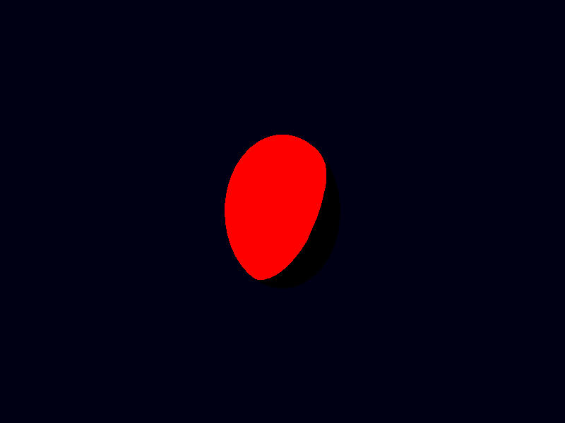
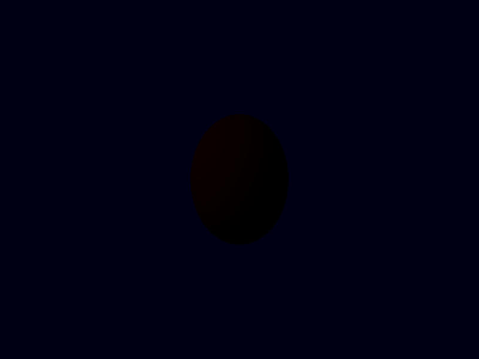

## Ashen Aetna 
#### — Rustily stumbling around on an ash-covered volcano 
###### (A tutorial on/in/about/with 3D graphics, Rust, Vulkan, ash)

# Light
Two chapters ago, we have introduced a light into our scene. We didn't give it much in the way of configurable parameters. The only property we
included was the direction to the light: 
```glsl
	vec3 direction_to_light=normalize(vec3(-1,-1,0));
```
But what if we want to specify the colour of the light? Or its brightness? 

First the brightness: How do we distinguish "much light" (think: sunlight at noon on a day with clear sky) from "not so much light" (sunlight on
cloudy day) and "very little light" (candle? moonlight?)?

## Physical quantities and units

Naively, *power* (energy per time, for light the "correct" name seems to be "radiant flux", the symbol Φ) sounds like a good idea. That sunlight 
and power are connected can be seen from solar panels. And solar panels produce a different amount of electrical power on sunny and on cloudy days. 

Problem: If on one day we decide to use a second solar panel, we suddenly obtain twice as much power, without the light having changed at all.

Solution: Let's not count power, but power per area. (Then twice as much power and twice as many solar panels cancel out.) This quantity, power per
area, is called *irradiance*, denoted by the letter E and measured in watts per square metre, W/m². 


A short aside: How to we count area? Even if we have two identical solar panels, it is certainly possible to arrange them such that one produces more
power than the other. I'm not talking about putting one in the shadow, just of their orientation: 


<p align="center">

</p>


It can therefore be a good idea to only count the area perpendicular to the light; that means a frequent occurrence of the factor "cosine of the angle between light
direction and normal direction of the surface" or, in other words, of the scalar product of those two directions 
(cf. [Chapter 25](025_Angles.md) for orthogonal parts of vectors and scalar products both). We will then speak of "projected area".


Often we are not really interested in the amount of light that arrives at one point, because we don't see all of it: We're only interested in the
light from a certain direction (or range of directions). New quantity: power per (projected) area *and per angle*. Wait: an angle was our measure for directions 
in the plane (the length of that part of the arc of a unit circle that is covered by these directions, [remember](025_Angles.md)?) — here we need
something measuring directions in space: the solid angle. We define it as the area on the surface of the unit sphere comprised of these directions. As
the surface area of a sphere with radius 1 is 4π, the solid angle "all directions" is 4π, the solid angle of a hemisphere (for example, "all directions pointing
more up than down") is 2π. If we want to indicate that a number we are talking about is supposed to indicate a solid angle, we can give it a unit: the
"steradian", sr. The solid angle of a hemisphere then is 2π sr. (In other words: with the above definition, "sr" is just a fancy way of writing "1";
like we sometimes use the number °=π/180 to indicate that we're talking about an angle - the more direct analogue would be the radian "rad", making the full
circle have an angle of 360° = 2π = 2π rad.)

So, *power per projected area and per solid angle*. This is the *radiance* (L, measured in watts per square metre and steradian, W/(m² sr)). Note that
"angle" in this formula means the *size* of the solid angle and not which directions contribute (although L may still *depend on* the direction, of course).

How does radiance change along a ray of light? Let us assume we have an area A₁ at the start point of the ray and A₂ at its end, both orthogonal to
the ray (that's no restriction, because radiance always assumes the projected, i.e. orthogonal, area anyway), and let us assume that the length of the
ray is d. Then the power leaving A₁ is A₁ω₁L₁ (with ω₁ being the angle and L₁ the radiance at the start point) and the power arriving at A₂ at the end of
the ray is A₂ω₂L₂. These two should be identical (energy, and hence power, if the light does not change over time, is conserved, as long as the light
does not interact with something (say, fog) between its start and end point). Now, ω₁ actually has the size A₂/d² (strictly speaking, this is an
approximation which is only very good if the distance is much larger than the size of the area), and ω₂ equals (with the same approximation) A₁/d².
Therefore, L₁A₁A₂/d² = A₁ω₁L₁ =  A₂ω₂L₂ = L₂ A₁A₂/d², that is, L₁=L₂. 

Hence: If there is nothing in the way, radiance is constant along light rays. 

For irradiance, this does not hold true. 

## Human perception: Other units; and colours 

Those above are suitable physical quantities to describe lights. There are associated quantities (and units) from another, let's say human-perception
point-of-view, that of "photometry": Instead of irradiance we use *illuminance* (still denoted by E, measured in lm/m², lumen per square metre, instead of W/m²) and
radiance is replaced by *luminance* (L, in lm/(m² sr) instead of W/(m² sr)). Apparrently, we have to figure out the difference between W and lm, and
then understand the difference between radiance and luminance (or irradiance and illuminance). 

It's a factor. 1 watt is 683 lumen. That's it — for a specific type of green light. It turns out that the colour (or rather: the wavelength) of light
has a rather large influence on how bright it appears, even if it has the same power. (Obviously, there are wavelengths which do not contribute to our
perception of brightness at all, because they are invisible — think of UV light —, but also within the visible range there are significant
differences.) We will ignore these differences, and pretend that radiance and luminance are easily interchangable.

(By the way: Some more names for units: candela, cd = lm/sr; lux: lx = lm/m².)

As to different colours: Well, as usual: We deal with values for L per component: One value for red, one for green and another for blue light. Keep in
mind that this is a simplification. There are many more different colours, different wavelengths for the light. And physically, "(monochromatic) yellow light" is different from "red light plus green light". 
(Since some optical phenomena depend on the wavelengths involved, these two types of light would behave differently; not only for the scaling factor between watt and lumen above.) 
However, for human perception, these two kinds of light are indistinguishable (if we're using the "right" combination of red and green, of course) and
we *pretend* that all light is just a mixture of red, green and blue light. Again: For seeing the light, this is okay: For every other colour we can find a
combination that looks the same. When the light hits, say, a sphere of the right (wrong?) material, the original light and our RGB replacement could
behave differently, that is, the light reflected by the sphere (which finally enters our eyes) could be different between original light and replacement, and not look the same any more. 
We hope for the best (namely, that this does not happen to a significant degree, or at least not in many important cases) — and ignore this. Having 3
values (instead of values for the whole range between about 400 and 700 nm) is so much simpler (and faster). 

If we have different lights and all affect the same point, we add their values and consider the sum of their radiances (or irradiances). 

This can easily lead to values above 1. (And in fact, the range of values is large: The radiance of sunlight is about 100 000 lm/(m² sr), that of
starlight 0.001 lm/(m² sr).) 

How do we turn these values into colours the screen understands? (We need values for R, G and B between 0 and 1, in the end.)

This is called "tone mapping". The simplest way might be to use min(1,max(L,0)), that is to clamp the value between 0 and 1.  This can very easily
lead to a completely white screen. 

Another way is to use L/(1+L) ("Reinhard tone mapping"). This compresses the whole range [0,∞) to the interval [0,1). For L close to 0, it's almost the same as L, but for large
values we remain below 1. Different large values lead to different colours, but the brighter they are, the smaller these differences will be. 

(There are other possibilities: Not only is the number "1" in the denominator arbitrary (and, by the way, should be carrying some unit of measurement), we could 
also use entirely different functions, with parameters that relate to the behaviour of physical cameras etc. — we will keep L/(1+L) for now (for red, green, blue each).) 

Very roughly, the colour of a pixel should be computed as follows: 

```
L=vec3(0);
for each light {
	L += contribution of this light to the radiance at the current pixel
}

colour = vec4(L.r/(1+L.r), L.g/(1+L.g), L.b/(1+L.b), 1.0);
```
And yes, it is the radiance rather than the irradiance that should be translated to pixel colours. We have seen above that radiance is, essentially,
a property of light rays. 


Often, the light that we see (or "measure") at a pixel will probably not come from the light source directly but from a surface which has been hit
(illuminated) by light rays. How to turn the arriving light (or rather: the irradiance at a surface) into the amount of leaving light (the outgoing radiance) will be central to the next chapter. 

First let's return to the original question: How do we characterize our light(s) by numbers? 


## Lights in numbers 

### Directional light

The directional light, the light we had before, does not quite exist in reality. But it is still a useful approximation of, for example, sunlight,
where the light source is so far away that light rays are as good as parallel to each other.

There is only one direction from which it comes, so the solid angle from which we receive this light is always 0. Therefore, we should not use
radiance to describe this light. Maybe we can use irradiance instead. Since the orientation of the light-receiving surface matters for irradiance, we choose to give 
the value for a surface orthogonal to the light direction. But even apart from that, usually, irradiance should decrease along light rays and would thus make a bad choice
for a number to characterize a light — but a directional light is thought to be "infinitely far away" from *every* point, so that's not a problem here, and we can
use irradiance. Or illuminance. Let's use illuminance.  

So, to wrap up: 

Parameters: A direction (the convention is to always use the direction *to* the light), that is, a `vec3` with unit length, and irradiance, a `vec3`,
for each of the colours red, green, blue containing the illuminance in lm/m² (or lx). 

Some values: [wikipedia](https://en.wikipedia.org/wiki/Lux).

### Point light 

Another type of light: Lights that have a position in the scene, but still no actual extension. Here, irradiance is not a good idea any more, because
it depends on the position. We can use the power Φ or the photometric analogue, the "luminous flux", the quantity measured in lumen. At distance d, we
then have an illuminance of Φ/(4πd²) (as the total power should be conserved, and at that distance the projected area covering all directions is that of
a sphere with radius d). We can tamper with the formula and instead use Φ/(4π max(d,0.001)²), so that we avoid division by zero or (if you prefer that
phrasing) take into account that actual point lights do not exist and nothing can get arbitrarily close to the light source.

Again: wrap-up:

Parameters: A position (vec3, components interpreted as metres) and the luminous flux (vec3, for RGB) in lm. 

Again, some values: [wikipedia](https://en.wikipedia.org/wiki/Luminous_flux)


## In the shaders

After that much theory (and all just to know with which numbers to describe a light), it seems time to write code and to produce pictures. 

Let us begin with a directional light. We change our fragment shader: 

```glsl
#version 450

layout (location=0) out vec4 theColour;

layout (location=0) in vec4 data_from_the_vertexshader;
layout (location=1) in vec3 normal;

void main(){
	vec3 L=vec3(0);

	vec3 direction_to_light=normalize(vec3(-1,-1,0));
	vec3 irradiance=vec3(32000,32000,32000);

	L +=  irradiance*(max(dot(normal,direction_to_light),0))*vec3(data_from_the_vertexshader);

	theColour=vec4(L/(1+L),1.0);
}
```
That should be sunlight. 
 

With 
```glsl 
	vec3 irradiance=vec3(0.1,0.1,0.1);
```
instead, we should have something like "red sphere in moonlight": 


By the way, do not pay too much mind to the line 
```glsl
	L +=  irradiance*(max(dot(normal,direction_to_light),0))*vec3(data_from_the_vertexshader);
```
We make sure that the irradiance is adjusted for the direction of the area and multiply it (componentwise) with the colour data arriving from the
vertexshader. We will take care of this part when we are done with the lights. 

For now, a bit or code rearrangement: 
```glsl
#version 450

layout (location=0) out vec4 theColour;

layout (location=0) in vec4 colour_in;
layout (location=1) in vec3 normal;


struct DirectionalLight{
	vec3 direction_to_light;
	vec3 irradiance;
};


void main(){
	vec3 L=vec3(0);

	DirectionalLight dlight = DirectionalLight(normalize(vec3(-1,-1,0)),vec3(10,10,10));

	L +=  dlight.irradiance*(max(dot(normal,dlight.direction_to_light),0))*vec3(colour_in);

	theColour=vec4(L/(1+L),1.0);
}
```
Two changes: I have renamed the colour variable, and the light has become a `struct` of its own:
```glsl 
struct DirectionalLight{
	vec3 direction_to_light;
	vec3 irradiance;
};
```
The definition looks self-explanatory enough. Its fields are accessed with a `.`, as in `dlight.irradiance`. And creating one work by 
```glsl
	DirectionalLight dlight = DirectionalLight(normalize(vec3(-1,-1,0)),vec3(10,10,10));
```
The constructor takes the arguments in the same order as they appear in the struct definition.


If we want to evaluate point lights, we definitely need the positions of the points as well. And those should be positions before the projection
matrix is applied. The distances enter in the lighting computations and those are affected by the projection. Let us directly use world coordinates.
That means a new output variable for the vertex shader. (And while we're at it, let's also change the colour output to `vec3`. We're ignoring the
fourth component anyways.)
```glsl
#version 450

layout (location=0) in vec3 position;
layout (location=1) in vec3 normal;
layout (location=2) in mat4 model_matrix;
layout (location=6) in mat4 inverse_model_matrix;
layout (location=10) in vec3 colour;

layout (set=0, binding=0) uniform UniformBufferObject {
	mat4 view_matrix;
	mat4 projection_matrix;
} ubo;

layout (location=0) out vec3 colourdata_for_the_fragmentshader;
layout (location=1) out vec3 out_normal;
layout (location=2) out vec4 worldpos;

void main() {
    worldpos = model_matrix*vec4(position,1.0);
    gl_Position = ubo.projection_matrix*ubo.view_matrix*worldpos;
    colourdata_for_the_fragmentshader=colour;
    out_normal = transpose(mat3(inverse_model_matrix))*normal;
}
```
Changed are the lines about `worldpos`.

In the fragment shader, the input variables change. (And we can remove one transformation from `vec4` to `vec3` for `colour_in`.)
```glsl
#version 450

layout (location=0) out vec4 theColour;

layout (location=0) in vec3 colour_in;
layout (location=1) in vec3 normal;
layout (location=2) in vec3 worldpos;


struct DirectionalLight{
	vec3 direction_to_light;
	vec3 irradiance;
};


void main(){
	vec3 L=vec3(0);

	DirectionalLight dlight=DirectionalLight(normalize(vec3(-1,-1,0)),vec3(10,10,10));

	L +=  dlight.irradiance*(max(dot(normal,dlight.direction_to_light),0))*colour_in;

	theColour=vec4(L/(1+L),1.0);
}
```

Now we add a point light.  


```glsl
#version 450

layout (location=0) out vec4 theColour;

layout (location=0) in vec3 colour_in;
layout (location=1) in vec3 normal;
layout (location=2) in vec3 worldpos;


struct DirectionalLight{
	vec3 direction_to_light;
	vec3 irradiance;
};

struct PointLight{
	vec3 position;
	vec3 luminous_flux;
};

void main(){
	vec3 L=vec3(0);

	DirectionalLight dlight = DirectionalLight(normalize(vec3(-1,-1,0)),vec3(0.1,0.1,0.1));

	L +=  dlight.irradiance*(max(dot(normal,dlight.direction_to_light),0))*colour_in;


	const float PI = 3.14159265358979323846264;	
	PointLight plight = PointLight(vec3(1.5,0.0,0.0),vec3(10,10,10));
	vec3 direction_to_light = normalize(plight.position - worldpos);
	float d = length(worldpos - plight.position);
	vec3 irradiance = light.luminous_flux/(4*PI*d*d);

	L +=  irradiance*(max(dot(normal,direction_to_light),0))*colour_in;

	theColour=vec4(L/(1+L),1.0);
}
```
Numbers roughly: Directional light: moon; point light: candle in 1 m distance. (Although pure white may be the wrong colour for that.)

Before we compute L in the same (basic and naive) way as before, we compute irradiance and light direction from the attributes of the point light and
the world position of the fragment.

And since we're computing radiance with the same formula in both places, let's turn this into a separate function on its own: 
```glsl
#version 450

layout (location=0) out vec4 theColour;

layout (location=0) in vec3 colour_in;
layout (location=1) in vec3 normal;
layout (location=2) in vec3 worldpos;


struct DirectionalLight{
	vec3 direction_to_light;
	vec3 irradiance;
};

struct PointLight{
	vec3 position;
	vec3 luminous_flux;
};

vec3 compute_radiance(vec3 irradiance, vec3 light_direction, vec3 normal, vec3 surface_colour){
	return irradiance*(max(dot(normal,light_direction),0))*surface_colour;
}

void main(){
	vec3 L=vec3(0);

	DirectionalLight dlight = DirectionalLight(normalize(vec3(-1,-1,0)),vec3(0.1,0.1,0.1));

	L += compute_radiance(dlight.irradiance, dlight.direction_to_light, normal, colour_in);


	const float PI = 3.14159265358979323846264;	
	PointLight plight = PointLight(vec3(1.5,0.0,0.0),vec3(10,10,10));
	vec3 direction_to_light = normalize(plight.position - worldpos);
	float d = length(worldpos - plight.position);
	vec3 irradiance = light.luminous_flux/(4*PI*d*d);

	L += compute_radiance(irradiance, direction_to_light, normal, colour_in);

	theColour=vec4(L/(1+L),1.0);
}
```
By the way, if we try to put the function definition below `main()` instead of above, we get 

```
error: 2 compilation errors:
./shaders/shader.frag:25: error: 'compute_radiance' : no matching overloaded function found
./shaders/shader.frag:34: error: 'compute_radiance' : no matching overloaded function found

  --> src/renderpass_and_pipeline.rs:88:51
   |
88 |             .code(vk_shader_macros::include_glsl!("./shaders/shader.frag"));
   |                                                   ^^^^^^^^^^^^^^^^^^^^^^^
   |
   = note: this error originates in a macro (in Nightly builds, run with -Z macro-backtrace for more info)
```
The function has to be defined (or at least declared) before it's invoked.


What if we want more point lights? 

Let's introduce a whole array: 
```glsl
	const int NUMBER_OF_POINTLIGHTS = 3;
	
	PointLight pointlights [NUMBER_OF_POINTLIGHTS] = { 
		PointLight(vec3(1.5,0.0,0.0),vec3(10,10,10)),
		PointLight(vec3(1.5,0.2,0.0),vec3(5,5,5)),
		PointLight(vec3(1.6,-0.2,0.1),vec3(5,5,5))
	};
```
and then use all of these lights in a `for` loop: 
```glsl
	for (int i=0; i<NUMBER_OF_POINTLIGHTS; i++){
```

This is the complete `main` of the fragment shader: 
```glsl
void main(){
	vec3 L=vec3(0);

	DirectionalLight dlight = DirectionalLight(normalize(vec3(-1,-1,0)),vec3(0.1,0.1,0.1));

	L += compute_radiance(dlight.irradiance, dlight.direction_to_light, normal, colour_in);

	const int NUMBER_OF_POINTLIGHTS = 3;
	
	PointLight pointlights [NUMBER_OF_POINTLIGHTS] = { 
		PointLight(vec3(1.5,0.0,0.0),vec3(10,10,10)),
		PointLight(vec3(1.5,0.2,0.0),vec3(5,5,5)),
		PointLight(vec3(0.1,-3.0,-3.0),vec3(5,5,5))
	};
	
	const float PI = 3.14159265358979323846264;	
	for (int i=0; i<NUMBER_OF_POINTLIGHTS; i++){
		PointLight light = pointlights[i];
		vec3 direction_to_light = normalize(light.position - worldpos);
		float d = length(worldpos - light.position);
		vec3 irradiance = light.luminous_flux/(4*PI*d*d);

		L += compute_radiance(irradiance, direction_to_light, normal, colour_in);
	};

	theColour=vec4(L/(1+L),1.0);
}
```

What we are still missing: Other types of lights, and, most of all, the ability to create (and move and delete) lights from the program instead of having them
statically in the shader. Let us postpone these. First, we should have a look at the `compute_radiance` function.

[Continue](034_BRDF.md)

