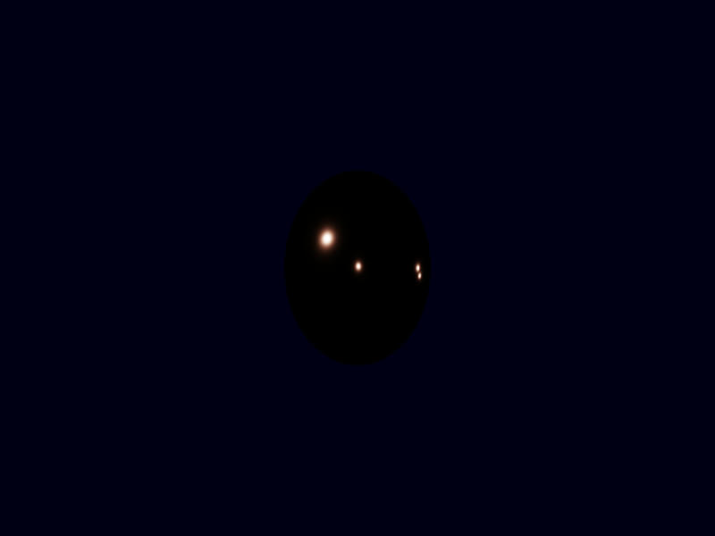

## Ashen Aetna 
#### — Rustily stumbling around on an ash-covered volcano 
###### (A tutorial on/in/about/with 3D graphics, Rust, Vulkan, ash)

# The BRDF
Last chapter, we have given numbers to lights in the scene. In particular, we have learned about radiance L (power per projected area and solid angle),
which is constant along each light ray and directly translates to the colour of a pixel, and irradiance E (power per area), which can be thought of as
the brightness reaching a surface. Knowing how the irradiance at a point on a surface corresponds to the radiance of the light leaving that point is
an important aspect of rendering. 

It makes sense that the relation between these two is a proportional. Twice as much incoming power should mean twice as much outgoing radiance.
Essentially: L = f E, with f being a proportionality factor (having the unit 1/sr).    

Not all light is equal. Its direction matters. Think of a mirror: One can only see light arriving from one direction: that which has the same
angle to the surface normal as the direction from the mirror to one's eye. Therefore, the proportionality factor should depend on the direction.
Actually, the direction*s*: The incoming direction 
 and the outgoing 
 (it is the convention that all directions point away from 
the surface): It should be 
, a function depending on two directions or a "bidirectional" function. 

Now, E is not really a quantity that is useful for a single direction. (For direction-independent radiance, it is proportional to the solid
angle, and the solid angle of a single direction is zero.) 

The radiance L, however, is quite naturally considered for single directions. And it can be used to compute E, after all, it was essentially the same,
just per solid angle. So, for an angle of the size 
, is 
? Careful: 
 — L's 
definition included "per projected area", E's "per area". 

If we care about the light from two directions (ω₁ and ω₂ with angles sized dω₁ and dω₂, respectively; and if we denote the normal by n), we can 
compute E by 
. However, this is not completely true. While L may be constant over a large angle 
("large" meaning that dω₁ is positive), the cosine (i.e., dot product) in this formula will never be: It should not be the cosine in direction ω₁ only, 
but vary over all directions involved in the angle dω₁ (of which there are infinitely many, unless the corresponding solid angle is zero), and the
same around ω₂. 

Thus we make those angles very small, and after a limit procedure, we end up with an integral formulation: 
.
(Herein, Ω is the set of all directions of interest. That could be the whole sphere, but very often is the hemisphere around n) 

In this integral form, it is easier to find the right place for f: 


<p align="center"></p>

Since this equation describes how (and which) light is reflected, it is called the "reflectance equation"; and f is referred to as "bidirectional
reflectance distribution function", short: BRDF. 

Some general properties of BRDFs: They are nonnegative, 
. They are symmetric in their arguments, 
 ("if I can
see you, you can see me"), and no energy is created: 
 (light can be absorbed, that's why "<1" is possible). 

Those general properties do not tell us much about the concrete form of f, of course. 


What happens to light that encounters a surface? Part of it is reflected (mirrored), the remaining part reflected (entering the surface and changing
its direction). 

The reflected light is visible in the direction having the same but opposite angle with the normal as the incident direction (and lying 
in the same plane as those two vectors). 

What happens to the refracted light is quite different, depending on the material. First possibility: It just travels on in the new direction. That's
water and other (near-)transparent materials, and the case we will ignore. Second possibility: It is absorbed (and thus immediately gone from consideration). 
That's metals. Third possibility: this light, now in the interior of the material, interacts with the atoms there. Part of it is absorbed, part
changes its directions whenever hitting the next atom. Finally, it leaves the surface again. The direction has nothing to do with the original
direction, the colour has changed because what light was absorbed is wavelength-dependent.  

New task for us: First figure out what part of the incoming light is reflected and what part is refracted. 

This question is answered by Fresnel's equations. (Sometimes one can find these equations for electric field instead of for power; then it's helpful
to remember that power is proportional to the square(d length) of the electric field vector. And usually they are concerned with the polarization of
the light, that is the direction in which the electric field oscillates (parallel or perpendicular to the plane of normal and incidence direction?),
 something we do not care about, because it (almost?) never contributes to the optical appearance — we can average over all directions and combine the
two factors for light parallel and orthogonal to the incidence plane by summing half of each (in the formulation for power, not for electric field).) 

The important dependency in these equations is that on the angle. The full formula involves the indices of refraction (and magnetic permeability) and
quite a few sines and cosines. There is a nice approximation that is based on the reflectance F₀ for light hitting the surface orthogonally and the
angle: The reflected part (as number between 0 and 1) at an angle θ (to the surface normal) is — approximately! —


<p align="center"></p>

This approximation is called Schlick's approximation. 

If we ignore, for a moment, what happens with the reflected light, our `compute_radiance` function could look like this: 

```glsl
vec3 compute_radiance(vec3 irradiance, vec3 light_direction, vec3 normal, vec3 surface_colour){
	float NdotL = max(dot(normal,light_direction),0);
	
	vec3 irradiance_on_surface = irradiance*NdotL;

	float F0 = 0.03; 
	vec3 reflected_irradiance = (F0 + (1 - F0)*(1-NdotL)*(1-NdotL)*(1-NdotL)*(1-NdotL)*(1-NdotL)) * irradiance_on_surface;
	vec3 refracted_irradiance = irradiance_on_surface - reflected_irradiance; 
	return refracted_irradiance*surface_colour;
}
```
From the irradiance that reaches this surface (recall that what we pass to the function is the irradiance on a surface orthogonal to the light,
because that's what we get know from our light sources and we therefore still have to adjust it by the factor normal dot light direction) we compute
how much is reflected (with Schlick's approximation of the Fresnel equations) and how much is refracted (the rest). 

To see how much this "rest" is, we should integrate the radiance (the return value, if we ignore the colour) over the hemisphere (all possible outgoing 
directions - how much of the refracted (and later: scattered) light each of these receives is direction-independent), weighted by the cosine 
factor: 
. Ooops. There's more light leaving than arriving. Better: 
```glsl
	return refracted_irradiance*surface_colour/PI;
```
(Often this π is cancelled by another factor π included in the definition of a light's strength. (Often in conjunction with the light's properties
being specified as radiance and not as irradiance.))

(And in the shader code, we probably have to move the definition of the constant `PI` to an earlier place.)

The Fresnel coefficient 0.03 at normal incidence is a realistic value for plastic. For plastic (and other "dielectric materials"), it's also
appropriate to turn all the refracted light into light of the surface colour and to return it. For metals, that's not true.

Let us include a parameter `metallic` which is either 0 or 1 and takes care of this difference: 
```glsl
vec3 compute_radiance(vec3 irradiance, vec3 light_direction, vec3 normal, vec3 surface_colour){
	float NdotL=	max(dot(normal,light_direction),0);
	
	vec3 irradiance_on_surface=irradiance*NdotL;

	float metallic = 0.0;

	float F0 = 0.03; 
	vec3 reflected_irradiance = (F0 + (1 - F0)*(1-NdotL)*(1-NdotL)*(1-NdotL)*(1-NdotL)*(1-NdotL)) * irradiance_on_surface;
	vec3 refracted_irradiance = irradiance_on_surface - reflected_irradiance; 
	vec3 refracted_not_absorbed_irradiance = refracted_irradiance * (1-metallic);
	return refracted_not_absorbed_irradiance*surface_colour/PI;
}
```

If we switch `metallic` to one, the sphere will remain black now. On the other hand, for metals reflections are rather important, and we are ignoring
these. For reflections, we must know about the view direction, not only the direction of the light. 

The fragment shader does not know the position of the camera. There are two possible solutions for this: Tell the shader where the camera is or make
it unnecessary to tell it. "Make it unnecessary" could be achieved by transforming all shading calculations in camera space (not only use the model
matrix to transform the points, but model matrix and view matrix, and transmit the position of each vertex as position relative to the camera instead
of as world position). Telling the shader could mean reading it from the view matrix. After all, all positional (and directional) information about
the camera is contained in that matrix, and we already pass it to the shader. 

Well, to the vertex shader only, in fact. (We had to declare, somewhere, in which of the shaders we wanted to access the uniform.)  

We could introduce a new uniform and just read from there. (And that's probably sensible: The amount of data is 12 bytes per frame, that's probably
better than any amount of computations per vertex or even per fragment.) But we can really get the values from the view matrix. In the vertex shader,
we add `layout (location=3) out vec3 camera_coordinates;` and 
```glsl
    camera_coordinates =
	- ubo.view_matrix[3][0] * vec3 (ubo.view_matrix[0][0],ubo.view_matrix[1][0],ubo.view_matrix[2][0])
	- ubo.view_matrix[3][1] * vec3 (ubo.view_matrix[0][1],ubo.view_matrix[1][1],ubo.view_matrix[2][1])
	- ubo.view_matrix[3][2] * vec3 (ubo.view_matrix[0][2],ubo.view_matrix[1][2],ubo.view_matrix[2][2]);
```
Note that `matrix[a][b]` means the `b`th component of the `a`th column (`matrix[a]`) of the matrix (so 
 or rather 
 in conventional notation). 
Using that the vectors "right", "down", "view" contained in the rows of this matrix are orthogonal to each other and have unit length, you can easily
check that the view matrix transforms `vec4(camera_coordinates,1.0)` into `vec4(0)`, i.e. that `camera_coordinates` actually contains the camera
coordinates. 

In the fragment shader: `layout (location=3) in vec3 camera_coordinates;`. At the beginning of its main, we then compute the direction to the camera: 
```glsl
	vec3 direction_to_camera = normalize(camera_coordinates - worldpos);
```
and pass this as argument to the `compute_radiance` function, whose signature becomes:
```glsl
vec3 compute_radiance(vec3 irradiance, vec3 light_direction, vec3 normal, vec3 camera_direction, vec3 surface_colour)
```
What do we do with this direction? We figure out whether the reflected light is relevant for us, i.e. whether it matches the view direction; and if
so, we add it to the returned radiance. Approximately like this: 
```glsl
vec3 compute_radiance(vec3 irradiance, vec3 light_direction, vec3 normal, vec3 camera_direction, vec3 surface_colour){
	float NdotL=	max(dot(normal,light_direction),0);
	
	vec3 irradiance_on_surface=irradiance*NdotL;

	float metallic = 0.0;

	float F0 = 0.03; 
	vec3 reflected_irradiance = (F0 + (1 - F0)*(1-NdotL)*(1-NdotL)*(1-NdotL)*(1-NdotL)*(1-NdotL)) * irradiance_on_surface;
	vec3 refracted_irradiance = irradiance_on_surface - reflected_irradiance; 
	vec3 refracted_not_absorbed_irradiance = refracted_irradiance * (1-metallic);
	vec3 relevant_reflection = vec3(0);
	if (false) {
		relevant_reflection = reflected_irradiance;
	}
	return refracted_not_absorbed_irradiance*surface_colour/PI + relevant_reflection;
}
```
only with a better condition than `if (false)`, of course. (But we can already commit the form of `if` statements in GLSL to memory; this is our first
one, I think.)

Now: What should the condition be? For reflected light, the angle between normal and outgoing light should be the same as the angle between normal and
incoming light. That is correct, but not helpful: In fact, there are many more directions with this property. (If the world were two-dimensional and
the surface 1D, then that would suffice.) 

The normal should lie in the middle between the directions of arriving and leaving light ray. That's better - and describes a unique direction. 
So, maybe: 
```glsl
	if (length(normalize(0.5*(camera_direction + light_direction))-normal)<0.01) {
```
(Equality means: single point; it's not probable that that single point is just the one point at the middle of a pixel; let's use this small number
instead.) 

Also: Let us make sure that the normal has unit length, that's rather important here. So: 
```glsl
	vec3 normal = normalize(normal);
```
at the top of main sound good. (Why is it necessary? The normal should already have unit length at the end of the vertex shader, shouldn't it? Yes,
but after that it is interpolated. Linearly over the triangle. And there we can easily loose this nice property.)

Still nothing to see? 

Just for testing: 
```glsl
		relevant_reflection = reflected_irradiance+vec3(10000);
```
Ah, now there are white points. Turns out the amount of reflected light at the points where the reflection would be was not that large. Well, it's not
as if we were dealing with a mirror. 

Speaking of which: Let's have a look at metals. Considering this code: 
```glsl
vec3 compute_radiance(vec3 irradiance, vec3 light_direction, vec3 normal, vec3 camera_direction, vec3 surface_colour){
	float NdotL=	max(dot(normal,light_direction),0);
	
	vec3 irradiance_on_surface=irradiance*NdotL;

	float metallic = 0.0;

	float F0 = 0.03; 
	vec3 reflected_irradiance = (F0 + (1 - F0)*(1-NdotL)*(1-NdotL)*(1-NdotL)*(1-NdotL)*(1-NdotL)) * irradiance_on_surface;
	vec3 refracted_irradiance = irradiance_on_surface - reflected_irradiance; 
	vec3 refracted_not_absorbed_irradiance = refracted_irradiance * (1-metallic);
	vec3 relevant_reflection = vec3(0);
	if (length(normalize(0.5*(camera_direction + light_direction))-normal)<0.01) {
		relevant_reflection = reflected_irradiance;
	}
	return refracted_not_absorbed_irradiance*surface_colour/PI + relevant_reflection;
}
```
— which colour do metals have? Answer: That of the reflected light, with no influence of the surface colour. That's not too unnatural: We said colour
results from light interacting with atoms inside the material, and we said that this light is immediately absorbed for metals. 

But I am quite sure that iron, copper or gold (all metals) look quite different from each other. Why is that? 

Well, `float F0=0.03` is a lie. Not only because the value is wrong for metals, but because this should not be a single number: indices of refraction
(and, accordingly, F0) are wavelength-dependent. Not so much for dielectrics, but very much so for metals. 

The best approximation that fits in our framework is one using different values for F0 for red, green and blue. For example, for copper it would be
0.955 for red, 0.638 for green and 0.538 for blue (Real-Time Rendering, 4th edition, p.323) 

```glsl
	float metallic = 1.0;

	vec3 F0 = vec3(0.955,0.638,0.538);
```
Changing F0 from `float` to `vec3` does not require further changes to the formula. GLSL can cope with that, "just using component-wise operations
everywhere". 

This gives: 


The points where light is reflected look ... a bit like copper, okay. 

Before we take care of the other points on the sphere: That F0 is encoded in the shader is not optimal. At the same time, we are not using the surface
colour for metals. 

It is a good idea to use the colour as values for F0 for metals. For non-metals we keep the meaning of the colour as before. Then where do we store
the value of F0 for non-metals? Well, actually, those values are not too different from each other: 0.02 for water, 0.058 for teeth, stone between
0.03 and 0.056, 0.04 for glass ... up to 0.08 for gems except diamonds. If we don't want to deal with another "colour"-like parameter, we can keep the
0.03 we had before. 

For non-metallic (`metallic=0.0`) materials: F0=0.03, for metallic: F0=colour. Or combined: 
```glsl 
	vec3 F0 = mix(vec3(0.03),colour_in,vec3(metallic));
```

Somehow, it still bothers me that metals are completely dark outside the reflection spots. On the other hand, for some metals that is quite realistic.
Think of mirrors or extremely smooth surfaces. But not all surfaces are mirrors. 

Somehow, we should include the roughness of surfaces. 

What is roughness? 

A surface is rough if it is not smooth, or: if it is not flat. We could describe this as: There is not only one surface normal. 

And, of course, there are different normals. At each point we have a different normal. The point here is that we now want to admit different normals
even within a single point (which is not to be thought of as a perfect ideal point with no dimensions, but as a point of the size of one pixel).
Different normals (of not one surface, but of microscopic "microsurfaces" at this point) means that suddenly not only at one point of the sphere the
surface has "the right normal" to show the light, but at every point "some of the normals are right". 

In practical terms that means that we get to replace the construction of "if the angle is right, add the reflected irradiance" by "always add a
certain fraction of the irradiance". How much "a certain fraction" should be still depends on the directions of light, view and (main) normal. 

In describing this "certain fraction", two factors play a role: a distribution function (what fraction of the microsurfaces has this normal?) and a
masking-shadowing (or "geometry") function (how visible are these microsurfaces? — even if a large part points in this direction, that will not matter if the light
can't reach them or they are not visible from the viewpoint, because some other microsurfaces are in the way). 

```glsl
vec3 compute_radiance(vec3 irradiance, vec3 light_direction, vec3 normal, vec3 camera_direction, vec3 surface_colour){
	float NdotL=	max(dot(normal,light_direction),0);
	
	vec3 irradiance_on_surface=irradiance*NdotL;

	float metallic = 1.0;
	float roughness = 0.1;
	roughness=roughness*roughness;

	vec3 F0 = mix(vec3(0.03),surface_colour,vec3(metallic));
	vec3 reflected_irradiance = (F0 + (1 - F0)*(1-NdotL)*(1-NdotL)*(1-NdotL)*(1-NdotL)*(1-NdotL)) * irradiance_on_surface;
	vec3 refracted_irradiance = irradiance_on_surface - reflected_irradiance; 
	vec3 refracted_not_absorbed_irradiance = refracted_irradiance * (1-metallic);

	vec3 halfvector=normalize(0.5*(camera_direction + light_direction));
	float NdotH=max(dot(normal,halfvector),0);
	vec3 F=(F0 + (1 - F0)*(1-NdotH)*(1-NdotH)*(1-NdotH)*(1-NdotH)*(1-NdotH));
	vec3 relevant_reflection = reflected_irradiance*F*geometry(light_direction,normal,camera_direction,roughness)*distribution(normal,halfvector,roughness);

	return refracted_not_absorbed_irradiance*surface_colour/PI + relevant_reflection;
}
```
Squaring the roughness parameter in a first step is done to have the values more sensibly distributed in the interval [0,1]. (This seems to be
standard. Since "roughness" is rather a phenomenological than a direct physical parameter and since we do not add roughness values, this
transformation (or arbitrary other transformations mapping [0,1] to [0,1]) will not hurt the model.) 

We are still using the vector "halfway between light and view direction" (which we have previously compared to the (macroscopic) normal). We modify
the reflected light by the Fresnel coefficient for this vector (as this is the "normal" direction contributing to the reflection), by a geometry
function and by a distribution function. 

For these functions there are different possible choices, arising from different modelling choices, different derivations, different guesses or
different approximations. 

We choose the following: 
```glsl
float distribution(vec3 normal,vec3 halfvector,float roughness){
	float NdotH=dot(halfvector,normal);
	if (NdotH>0){
		float r=roughness*roughness;
		return r / (PI* (1 + NdotH*NdotH*(r-1))*(1 + NdotH*NdotH*(r-1)));
	}else{
		return 0.0;
	}
}
```
and
```glsl
float geometry(vec3 light, vec3 normal, vec3 view, float roughness){
	float NdotL=abs(dot(normal,light));
	float NdotV=abs(dot(normal,view));
	return 0.5/max(0.01,mix(2*NdotL*NdotV,NdotL+NdotV,roughness));
}
```

Let's have a look (with the following copper sphere)
```rust
    sphere.insert_visibly(InstanceData::from_matrix_and_colour(
        na::Matrix4::new_scaling(0.5),
        [0.955, 0.638, 0.538],
    ));
```
with `roughness=0.1`:  

and with `roughness=0.5`: 

[Continue](035_StorageBuffer.md)


