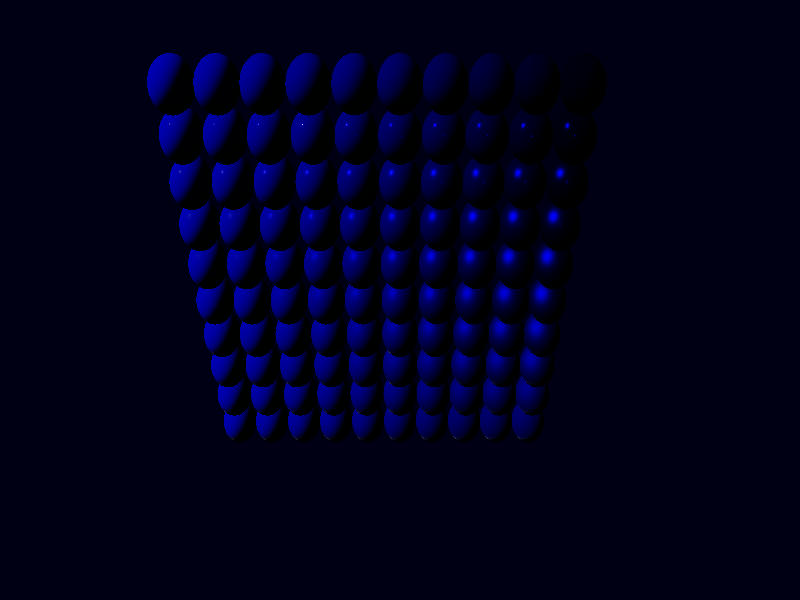

## Ashen Aetna 
#### — Rustily stumbling around on an ash-covered volcano 
###### (A tutorial on/in/about/with 3D graphics, Rust, Vulkan, ash)

# A storage buffer

(We'll get to the topic of the headline towards the end of this chapter.) 

I feel like every few chapters there's need for some cleanup (which, obviously, is an artifact of writing these as I go along instead of having them
planned in advance). This time, I want to liberate some of the settings from the shader program and put them into the Rust code.

First up: values for `roughness` and `metallic`. I think we should put them with the colour. That is, `InstanceData` should receive new entries: 
```rust
#[repr(C)]
pub struct InstanceData {
    pub modelmatrix: [[f32; 4]; 4],
    pub inverse_modelmatrix: [[f32; 4]; 4],
    pub colour: [f32; 3],
    pub metallic: f32,
    pub roughness: f32,
}
impl InstanceData {
    pub fn from_matrix_colour_metallic_and_roughness(
        modelmatrix: na::Matrix4<f32>,
        colour: [f32; 3],
        metallic: f32,
        roughness: f32,
    ) -> InstanceData {
        InstanceData {
            modelmatrix: modelmatrix.into(),
            inverse_modelmatrix: modelmatrix.try_inverse().unwrap().into(),
            colour,
            metallic,
            roughness,
        }
    }
}
```
The sphere in our scene then should, of course, be created by 
```rust
    sphere.insert_visibly(InstanceData::from_matrix_colour_metallic_and_roughness(
        na::Matrix4::new_scaling(0.5),
        [0.955, 0.638, 0.538],
        1.0,
        0.2
    ));
```
Also the `VertexAttributeInputDescriptions` (on pipeline creation) need an update (we have to get the data to the fragment shader, somehow):
```rust
             vk::VertexInputAttributeDescription {
                binding: 1,
                location: 11,
                offset: 140,
                format: vk::Format::R32_SFLOAT,
            },
             vk::VertexInputAttributeDescription {
                binding: 1,
                location: 12,
                offset: 144,
                format: vk::Format::R32_SFLOAT,
            },

        ];
        let vertex_binding_descs = [
            vk::VertexInputBindingDescription {
                binding: 0,
                stride: 24,
                input_rate: vk::VertexInputRate::VERTEX,
            },
            vk::VertexInputBindingDescription {
                binding: 1,
                stride: 148,
                input_rate: vk::VertexInputRate::INSTANCE,
            },
        ];
```
(Also the input rate of the `InputBindingDescription` has been updated.) 

In the vertex shader, we receive the new values: 
```glsl
layout (location=11) in float metallic_in;
layout (location=12) in float roughness_in;
```
announce our intent to just pass them over to the fragment shader: 
```glsl
layout (location=4) out float metallic;
layout (location=5) out float roughness;
```
and do so:
```glsl
    metallic=metallic_in;
    roughness=roughness_in;
```
We then receive these values in the fragment shader: 
```glsl
layout (location=4) in float metallic;
layout (location=5) in float roughness;
```
where we now can remove the previous definitions: 
```glsl
//	float metallic = 1.0;
//	float roughness = 0.5;
```
and are given an error message
```
shader.frag:47: error: 'assign' :  l-value required "roughness" (can't modify shader input)
```
due to this line: 
```glsl
	roughness=roughness*roughness;
```
I guess, we'll call it by another name now: 
```glsl
	float roughness2=roughness*roughness;
```
(and change the other occurrences of `roughness` (except in the `layout ... in` line) to `roughness2`, too).

To see the result of different values, let's change the setup: 
```rust
    for i in 0..10 {
        for j in 0..10 {
            sphere.insert_visibly(InstanceData::from_matrix_colour_metallic_and_roughness(
                na::Matrix4::new_translation(&na::Vector3::new(i as f32 - 5., j as f32 + 5., 10.0))
                    * na::Matrix4::new_scaling(0.5),
                [0., 0., 0.8],
                i as f32 * 0.1,
                j as f32 * 0.1,
            ));
        }
    }
```


This is with `roughness` zero at the top, one at the bottom (you can recognize smooth surfaces from the highlights of the reflections being small), and
`metallic` increasing left to right. (Metallic values that are not close to either zero or one should usually be avoided. As to metallic=0.9: That's
metal with a bit of dust covering 10% of each pixel.)

The lighting situation may not be optimal.

Speaking of light: Can we also get the data for the lights from the program? 

They certainly are not part of the vertices. Maybe they should form another uniform buffer, like the camera information. 

We should also make sure that we can represent the lights in our program. Let's begin by creating a new file `light.rs`, where we can define
`PointLight` and `DirectionalLight` and some place to collect all of our lights, say `LightManager` (with horribly ad hoc and un-engineered
structure): 

```rust
use nalgebra as na;

pub struct DirectionalLight {
    pub direction: na::Vector3<f32>,
    pub illuminance: [f32; 3], //in lx = lm/m^2
}

pub struct PointLight {
    pub position: na::Point3<f32>, //in m
    pub luminous_flux: [f32; 3],   //in lm
}

pub enum Light {
    Directional(DirectionalLight),
    Point(PointLight),
}

impl From<PointLight> for Light {
    fn from(p: PointLight) -> Self {
        Light::Point(p)
    }
}

impl From<DirectionalLight> for Light {
    fn from(d: DirectionalLight) -> Self {
        Light::Directional(d)
    }
}

pub struct LightManager {
    directional_lights: Vec<DirectionalLight>,
    point_lights: Vec<PointLight>,
}

impl Default for LightManager {
    fn default() -> Self {
        LightManager {
            directional_lights: vec![],
            point_lights: vec![],
        }
    }
}

impl LightManager {
    pub fn add_light<T: Into<Light>>(&mut self, l: T) {
        use Light::*;
        match l.into() {
            Directional(dl) => {
                self.directional_lights.push(dl);
            }
            Point(pl) => {
                self.point_lights.push(pl);
            }
        }
    }
}
```
In `main.rs` we create some lights (corresponding to those currently defined in the fragment shader)
```rust
    let mut lights = LightManager::default();
    lights.add_light(DirectionalLight {
        direction: na::Vector3::new(-1., -1., 0.),
        illuminance: [10.1, 10.1, 10.1],
    });
    lights.add_light(PointLight {
        position: na::Point3::new(0.1, -3.0, -3.0),
        luminous_flux: [100.0, 100.0, 100.0],
    });
    lights.add_light(PointLight {
        position: na::Point3::new(1.5, 0.0, 0.0),
        luminous_flux: [10.0, 10.0, 10.0],
    });
    lights.add_light(PointLight {
        position: na::Point3::new(1.5, 0.2, 0.0),
        luminous_flux: [5.0, 5.0, 5.0],
    });
```
supplemented by `mod light;` and `use crate::light::{DirectionalLight, LightManager, PointLight};`, of course.

We moreover give `LightManager` a function putting all data into some buffer. First the number of lights (of each kind), then the actual data
(direction and illuminance or position and luminous flux): 
```rust
    pub fn update_buffer(
        &self,
        allocator: &vk_mem::Allocator,
        buffer: &mut Buffer,
    ) -> Result<(), vk_mem::error::Error> {
       let mut data: Vec<f32> = vec![];
        data.push(self.directional_lights.len() as f32);
        data.push(self.point_lights.len() as f32);
        for dl in &self.directional_lights {
            data.push(dl.direction.x);
            data.push(dl.direction.y);
            data.push(dl.direction.z);
            data.push(dl.illuminance[0]);
            data.push(dl.illuminance[1]);
            data.push(dl.illuminance[2]);
        }
        for pl in &self.point_lights {
            data.push(pl.position.x);
            data.push(pl.position.y);
            data.push(pl.position.z);
            data.push(pl.luminous_flux[0]);
            data.push(pl.luminous_flux[1]);
            data.push(pl.luminous_flux[2]);
        }
        buffer.fill(allocator, &data)?;
        Ok(())
    }
```

Now: To store these things somewhere, we invent a new field of `Aetna` (like its `uniformbuffer`)
```rust
    pub lightbuffer: Buffer,
```
and create and fill it (on initialization just with zero directional and zero point lights): 
```rust
        let mut lightbuffer = Buffer::new
            &allocator,
            8,
            vk::BufferUsageFlags::UNIFORM_BUFFER,
            vk_mem::MemoryUsage::CpuToGpu,
        )?;
        lightbuffer.fill(&allocator, &[0.,0.])?;
```
Also in `Aetna::drop()`, one more buffer destruction should take place:
```rust
            self.allocator
                .destroy_buffer(self.lightbuffer.buffer, &self.lightbuffer.allocation)
                .expect("buffer destruction");
```
In the fragment shader, we include a uniform buffer object: 
```glsl
layout (set=1, binding=0) uniform UniformBufferObject {
	float num_directional;
	float num_point;
} ubo;
```
(This is not the final form; but it includes the two numbers we already have.)

For testing purposes, we insert the following lines at the end of `main()` in the fragment shader: 
```glsl
	if (ubo.num_directional==0.0){
		theColour=vec4(1.0,0.0,0.0,1.0);
	}
	if (ubo.num_directional==1.0){
		theColour=vec4(1.0,1.0,0.0,1.0);
	}
```
They destroy all of our work about colouring the spheres, but help make it obvious whether the shader has received the data we've sent. 

For sending data, let us prepare another uniform buffer: 

On pipeline creation (the first part was already there, apart from name changes, the second is new, but identical, apart from the names and the shader
stage): 
```rust
        let descriptorset_layout_binding_descs0 =
            [vk::DescriptorSetLayoutBinding::builder() 
                .binding(0)
                .descriptor_type(vk::DescriptorType::UNIFORM_BUFFER)
                .descriptor_count(1)
                .stage_flags(vk::ShaderStageFlags::VERTEX)
                .build()];
        let descriptorset_layout_info0 = vk::DescriptorSetLayoutCreateInfo::builder()
            .bindings(&descriptorset_layout_binding_descs0);
        let descriptorsetlayout0 = unsafe {
            logical_device.create_descriptor_set_layout(&descriptorset_layout_info0, None)
        }?;
        let descriptorset_layout_binding_descs1 = [vk::DescriptorSetLayoutBinding::builder()
            .binding(0)
            .descriptor_type(vk::DescriptorType::UNIFORM_BUFFER)
            .descriptor_count(1)
            .stage_flags(vk::ShaderStageFlags::FRAGMENT)
            .build()];
        let descriptorset_layout_info1 = vk::DescriptorSetLayoutCreateInfo::builder()
            .bindings(&descriptorset_layout_binding_descs1);
        let descriptorsetlayout1 = unsafe {
            logical_device.create_descriptor_set_layout(&descriptorset_layout_info1, None)
        }?;

        let desclayouts = vec![descriptorsetlayout0, descriptorsetlayout1]; 
```
And `Aetna` gets a replacement for its `descriptor_sets`:
```rust
    descriptor_sets_camera: Vec<vk::DescriptorSet>, 
    descriptor_sets_light: Vec<vk::DescriptorSet>, 
```
Again, the camera part gets new names, the light part is almost a copy: 
```rust
        let pool_sizes = [vk::DescriptorPoolSize {
            ty: vk::DescriptorType::UNIFORM_BUFFER,
            descriptor_count: 2 * swapchain.amount_of_images, //
        }];
        let descriptor_pool_info = vk::DescriptorPoolCreateInfo::builder()
            .max_sets(2 * swapchain.amount_of_images) //
            .pool_sizes(&pool_sizes);
        let descriptor_pool =
            unsafe { logical_device.create_descriptor_pool(&descriptor_pool_info, None) }?;

        let desc_layouts_camera =
            vec![pipeline.descriptor_set_layouts[0]; swapchain.amount_of_images as usize];
        let descriptor_set_allocate_info_camera = vk::DescriptorSetAllocateInfo::builder()
            .descriptor_pool(descriptor_pool)
            .set_layouts(&desc_layouts_camera);
        let descriptor_sets_camera = unsafe {
            logical_device.allocate_descriptor_sets(&descriptor_set_allocate_info_camera)
        }?;

        for descset in &descriptor_sets_camera {
            let buffer_infos = [vk::DescriptorBufferInfo {
                buffer: uniformbuffer.buffer,
                offset: 0,
                range: 128,
            }];
            let desc_sets_write = [vk::WriteDescriptorSet::builder()
                .dst_set(*descset)
                .dst_binding(0)
                .descriptor_type(vk::DescriptorType::UNIFORM_BUFFER)
                .buffer_info(&buffer_infos)
                .build()];
            unsafe { logical_device.update_descriptor_sets(&desc_sets_write, &[]) };
        }
        let desc_layouts_light =
            vec![pipeline.descriptor_set_layouts[1]; swapchain.amount_of_images as usize];
        let descriptor_set_allocate_info_light = vk::DescriptorSetAllocateInfo::builder()
            .descriptor_pool(descriptor_pool)
            .set_layouts(&desc_layouts_light);
        let descriptor_sets_light = unsafe {
            logical_device.allocate_descriptor_sets(&descriptor_set_allocate_info_light)
        }?;

        for descset in &descriptor_sets_light {
            let buffer_infos = [vk::DescriptorBufferInfo {
                buffer: lightbuffer.buffer,
                offset: 0,
                range: 8,
            }];
            let desc_sets_write = [vk::WriteDescriptorSet::builder()
                .dst_set(*descset)
                .dst_binding(0)
                .descriptor_type(vk::DescriptorType::UNIFORM_BUFFER)
                .buffer_info(&buffer_infos)
                .build()];
            unsafe { logical_device.update_descriptor_sets(&desc_sets_write, &[]) };
        }
```
In `Aetna::update_commandbuffer()` we bind both descriptor sets: that for camera and that for light:
```rust
            self.device.cmd_bind_descriptor_sets(
                commandbuffer,
                vk::PipelineBindPoint::GRAPHICS,
                self.pipeline.layout,
                0,
                &[
                    self.descriptor_sets_camera[index],
                    self.descriptor_sets_light[index],
                ],
                &[],
            );
```
... and all spheres turn red. Good. Let's fill the `lightbuffer` with the actual data: 
```rust
    lights.update_buffer(&aetna.allocator, &mut aetna.lightbuffer)?;
```
(just after all of the `add_lights` commands). Now the spheres turn yellow (which is good: there is one directional light now), BUT:
```
[Debug][error][validation] "VkDescriptorSet 0x2b000000002b[] bound as set #1 encountered the following validation error at vkCmdDrawIndexed() 
time: Descriptor in binding #0 index 0 is using buffer VkBuffer 0x260000000026[] that is invalid or has been destroyed."
```
When we updated the buffer, we wanted to write more bytes than its size, thus destroyed it and created a new one. Compare our `Buffer::fill()`
function:
```rust
    pub fn fill<T: Sized>(
        &mut self,
        allocator: &vk_mem::Allocator,
        data: &[T],
    ) -> Result<(), vk_mem::error::Error> {
        let bytes_to_write = (data.len() * std::mem::size_of::<T>()) as u64;
        if bytes_to_write > self.size_in_bytes {
            allocator.destroy_buffer(self.buffer, &self.allocation)?;
            let newbuffer = Buffer::new(
                allocator,
                bytes_to_write,
                self.buffer_usage,
                self.memory_usage,
            )?;
            *self = newbuffer;
        }
        let data_ptr = allocator.map_memory(&self.allocation)? as *mut T;
        unsafe { data_ptr.copy_from_nonoverlapping(data.as_ptr(), data.len()) };
        allocator.unmap_memory(&self.allocation)?;
        Ok(())
    }
```
But the descriptor sets still said to use the old buffer. 

Let us rectify this by changing the `update_buffer` function: 
```rust
    pub fn update_buffer(
        &self,
        logical_device: &ash::Device,
        allocator: &vk_mem::Allocator,
        buffer: &mut Buffer,
        descriptor_sets_light: &mut [vk::DescriptorSet],
    ) -> Result<(), vk_mem::error::Error> {
        let mut data: Vec<f32> = vec![];
        data.push(self.directional_lights.len() as f32);
        data.push(self.point_lights.len() as f32);
        for dl in &self.directional_lights {
            data.push(dl.direction.x);
            data.push(dl.direction.y);
            data.push(dl.direction.z);
            data.push(dl.illuminance[0]);
            data.push(dl.illuminance[1]);
            data.push(dl.illuminance[2]);
        }
        for pl in &self.point_lights {
            data.push(pl.position.x);
            data.push(pl.position.y);
            data.push(pl.position.z);
            data.push(pl.luminous_flux[0]);
            data.push(pl.luminous_flux[1]);
            data.push(pl.luminous_flux[2]);
        }
        buffer.fill(allocator, &data)?;
        for descset in descriptor_sets_light {
            let buffer_infos = [vk::DescriptorBufferInfo {
                buffer: buffer.buffer,
                offset: 0,
                range: 4 * data.len() as u64,
            }];
            let desc_sets_write = [vk::WriteDescriptorSet::builder()
                .dst_set(*descset)
                .dst_binding(0)
                .descriptor_type(vk::DescriptorType::UNIFORM_BUFFER)
                .buffer_info(&buffer_infos)
                .build()];
            unsafe { logical_device.update_descriptor_sets(&desc_sets_write, &[]) };
        }

        Ok(())
    }
```
This way we're always using the most current buffer, and the size is also corrected. (A possible improvement would be to only update the descriptor
set when necessary, but we don't do that.) 

This takes care of the error message.

Time to read more data out of the uniform: 
```glsl
layout (set=1, binding=0) uniform UniformBufferObject {
	float num_directional;
	float num_point;
	vec3 data[];
} ubo;
```
(the line with `data[]` is new, an array of unspecified size)

And at the end of main, again just for testing purposes, but otherwise rather nonsensical: 
```glsl
	theColour=vec4(vec3(0.0),1.0);
	for (int i=0;i<ubo.num_directional;i++){
		vec3 data1=ubo.data[2+3*i];
		theColour+=vec4(data1,0.0); 	
	}
```
This results in ... another error: 
```
/shaders/shader.frag:103: error: '[' :  array must be redeclared with a size before being indexed with a variable
```
The size of an array and an index to be used may not both be unknown or variable. That is not good. We could just invent a maximal number of lights to
take into account (that would also make it possible to create one buffer in the beginning, and then use it without changing it or the descriptor sets), but is there another way? 

There is. We do not use uniform buffers, but a storage buffer instead:
```glsl
 layout (set=1, binding=0) buffer UniformBufferObject {
	float num_directional;
	float num_point;
	vec3 data[];
} ubo;
```
Two messages from the validation layers: 
```
[Debug][error][validation] "Shader requires fragmentStoresAndAtomics but is not enabled on the device"
[Debug][error][validation] "Type mismatch on descriptor slot 1.0 (expected `VK_DESCRIPTOR_TYPE_STORAGE_BUFFER, VK_DESCRIPTOR_TYPE_STORAGE_BUFFER_DYNAMIC`) but descriptor of type V
K_DESCRIPTOR_TYPE_UNIFORM_BUFFER"
```
We are still saying "uniform buffer" throughout our code (and will have to change that), and there should be a special device extension enabled. This
extension is necessary if we want to read from and write to the buffer, which we don't. We can promise as much by inserting a `readonly` qualifier: 
```glsl
readonly layout (set=1, binding=0) buffer UniformBufferObject {
	float num_directional;
	float num_point;
	vec3 data[];
} ubo;
```
This removes the first error message.

As to the second: We replace some `vk::DescriptorType::UNIFORM_BUFFER` by `vk::DescriptorType::STORAGE_BUFFER`: 
In the definition of `descriptorset_layout_binding_descs1` on pipeline creation, in `LightManager::update_buffer()` and in `Aetna::init()`, where we
also ensure that the descriptor pool has room for descriptors of this type: 
```rust
        let pool_sizes = [
            vk::DescriptorPoolSize {
                ty: vk::DescriptorType::UNIFORM_BUFFER,
                descriptor_count: swapchain.amount_of_images,
            },
            vk::DescriptorPoolSize {
                ty: vk::DescriptorType::STORAGE_BUFFER,
                descriptor_count: swapchain.amount_of_images,
            },
        ];
```
Okay, let's see how well that works. Our first (and only) directional light is changed: 
```rust
    lights.add_light(DirectionalLight {
        //     direction: na::Vector3::new(-1., -1., 0.),
        direction: na::Vector3::new(0., 1., 0.),
        illuminance: [10.1, 10.1, 10.1],
    });
```
and at the end of the fragment shader we try: 
```glsl
	theColour=vec4(vec3(0.0),1.0);
	for (int i=0;i<ubo.num_directional;i++){
		vec3 data1=ubo.data[2*i];
		vec3 data2=ubo.data[2*i+1];
		theColour+=vec4(data1,0.0); 	
	}
```
That should lead to green balls, right? It doesn't. They look rather cyan.

Was it the wrong order? Do we read the illuminance value? Let's try
```rust
    lights.add_light(DirectionalLight {
        //     direction: na::Vector3::new(-1., -1., 0.),
        direction: na::Vector3::new(0., 1., 0.),
        //illuminance: [10.1, 10.1, 10.1],
        illuminance: [0.0, 1.0, 0.0],
    });
```
Blue!?

And this? 
```rust
    lights.add_light(DirectionalLight {
        //     direction: na::Vector3::new(-1., -1., 0.),
        direction: na::Vector3::new(0., 0., 1.),
        //illuminance: [10.1, 10.1, 10.1],
        illuminance: [0.0, 1.0, 0.0],
    });
```
Pink.
```rust
    lights.add_light(DirectionalLight {
        //     direction: na::Vector3::new(-1., -1., 0.),
        direction: na::Vector3::new(0., 0., 1.),
        //illuminance: [10.1, 10.1, 10.1],
        illuminance: [1.0, 0.0, 0.0],
    });
```
Yellow. 

It seems that we are using the last component of the first vector and the first two components of the second. What's going on? 

When we want to take variables out of a buffer, they have to be aligned correctly, they may not start at any arbitrary position. Each float is 4 bytes
large and may begin with bytes 0, 4, 8, etc. That's not a problem, we have put four bytes large values after each other, and have tried to retrieve
four bytes large values after each other, which were aligned at these multiples of four bytes. 

BUT: a vec3 is not just "three floats after each other", but according to [the Vulkan spec](https://www.khronos.org/registry/vulkan/specs/1.0-wsi_extensions/html/vkspec.html#interfaces-resources-layout), has an alignment of *four* floats: 
"A three- or four-component vector has a base alignment equal to four times its scalar alignment."

That means: Even if we only store two floats (at positions zero and one (or zero and four, if you prefer counting in bytes instead of in float
sizes)) at the start of the buffer, the first possible position for our data values is position four (or 16, in bytes). Hence the first two components
of the direction vector get ignored.

Now that we know two of the floats will be ignored, we can just make sure that there are two floats we don't need: `data.push(0.0);`, twice after the
lengths, once after each `vec3`:
```rust
    pub fn update_buffer(
        &self,
        logical_device: &ash::Device,
        allocator: &vk_mem::Allocator,
        buffer: &mut Buffer,
        descriptor_sets_light: &mut [vk::DescriptorSet],
    ) -> Result<(), vk_mem::error::Error> {
        let mut data: Vec<f32> = vec![];
        data.push(self.directional_lights.len() as f32);
        data.push(self.point_lights.len() as f32);
        data.push(0.0);
        data.push(0.0);
        for dl in &self.directional_lights {
            data.push(dl.direction.x);
            data.push(dl.direction.y);
            data.push(dl.direction.z);
            data.push(0.0);
            data.push(dl.illuminance[0]);
            data.push(dl.illuminance[1]);
            data.push(dl.illuminance[2]);
            data.push(0.0);
        }
        for pl in &self.point_lights {
            data.push(pl.position.x);
            data.push(pl.position.y);
            data.push(pl.position.z);
            data.push(0.0);
            data.push(pl.luminous_flux[0]);
            data.push(pl.luminous_flux[1]);
            data.push(pl.luminous_flux[2]);
            data.push(0.0);
        }
        buffer.fill(allocator, &data)?;
        for descset in descriptor_sets_light {
            let buffer_infos = [vk::DescriptorBufferInfo {
                buffer: buffer.buffer,
                offset: 0,
                range: 4 * data.len() as u64,
            }];
            let desc_sets_write = [vk::WriteDescriptorSet::builder()
                .dst_set(*descset)
                .dst_binding(0)
                .descriptor_type(vk::DescriptorType::STORAGE_BUFFER)
                .buffer_info(&buffer_infos)
                .build()];
            unsafe { logical_device.update_descriptor_sets(&desc_sets_write, &[]) };
        }
        Ok(())
    }
```
Now that's better. 

We can use the buffer content as values for our lights (instead of the values written in the shader code), and get rid of the "debugging"
functionality in the shader's `main()`:
```glsl
void main(){
	vec3 L=vec3(0);
	vec3 direction_to_camera = normalize(camera_coordinates - worldpos);
	vec3 normal = normalize(normal);

	int number_directional=int(ubo.num_directional);
	int number_point=int(ubo.num_point);

	for (int i=0;i<number_directional;i++){
		vec3 data1=ubo.data[2*i];
		vec3 data2=ubo.data[2*i+1];
		DirectionalLight dlight = DirectionalLight(normalize(data1),data2);

		L += compute_radiance(dlight.irradiance, dlight.direction_to_light, normal, direction_to_camera, colour_in);
	}

	for (int i=0;i<number_point;i++){	
		vec3 data1=ubo.data[2*i+2*number_directional];
		vec3 data2=ubo.data[2*i+1+2*number_directional];
		PointLight light = PointLight(data1,data2);
		vec3 direction_to_light = normalize(light.position - worldpos);
		float d = length(worldpos - light.position);
		vec3 irradiance = light.luminous_flux/(4*PI*d*d);

		L += compute_radiance(irradiance, direction_to_light, normal, direction_to_camera, colour_in);
	}

	theColour=vec4(L/(1+L),1.0);
}
```
With these lights: 
```rust
    let mut lights = LightManager::default();
    lights.add_light(DirectionalLight {
        direction: na::Vector3::new(-1., -1., 0.),
        illuminance: [10.1, 10.1, 10.1],
    });
    lights.add_light(PointLight {
        position: na::Point3::new(0.1, -3.0, -3.0),
        luminous_flux: [100.0, 100.0, 100.0],
    });
    lights.add_light(PointLight {
        position: na::Point3::new(0.1, -3.0, -3.0),
        luminous_flux: [100.0, 100.0, 100.0],
    });
    lights.add_light(PointLight {
        position: na::Point3::new(0.1, -3.0, -3.0),
        luminous_flux: [100.0, 100.0, 100.0],
    });
```
it now looks as before.

And maybe, just maybe, we should no longer call our storage buffer a "uniform buffer object" or "ubo". So, with slight name changes, the whole
fragment shader: 
```glsl
#version 450

layout (location=0) out vec4 theColour;

layout (location=0) in vec3 colour_in;
layout (location=1) in vec3 normal;
layout (location=2) in vec3 worldpos;
layout (location=3) in vec3 camera_coordinates;
layout (location=4) in float metallic;
layout (location=5) in float roughness;

readonly layout (set=1, binding=0) buffer StorageBufferObject {
	float num_directional;
	float num_point;
	vec3 data[];
} sbo;


const float PI = 3.14159265358979323846264;	

struct DirectionalLight{
	vec3 direction_to_light;
	vec3 irradiance;
};

struct PointLight{
	vec3 position;
	vec3 luminous_flux;
};

float distribution(vec3 normal,vec3 halfvector,float roughness2){
	float NdotH=dot(halfvector,normal);
	if (NdotH>0){
		float r=roughness2*roughness2;
		return r / (PI* (1 + NdotH*NdotH*(r-1))*(1 + NdotH*NdotH*(r-1)));
	}else{
		return 0.0;
	}
}

float geometry(vec3 light, vec3 normal, vec3 view, float roughness2){
	float NdotL=abs(dot(normal,light));
	float NdotV=abs(dot(normal,view));
	return 0.5/max(0.01,mix(2*NdotL*NdotV,NdotL+NdotV,roughness2));
}

vec3 compute_radiance(vec3 irradiance, vec3 light_direction, vec3 normal, vec3 camera_direction, vec3 surface_colour){
	float NdotL=	max(dot(normal,light_direction),0);
	
	vec3 irradiance_on_surface=irradiance*NdotL;

	float roughness2=roughness*roughness;

	vec3 F0 = mix(vec3(0.03),surface_colour,vec3(metallic));
	vec3 reflected_irradiance = (F0 + (1 - F0)*(1-NdotL)*(1-NdotL)*(1-NdotL)*(1-NdotL)*(1-NdotL)) * irradiance_on_surface;
	vec3 refracted_irradiance = irradiance_on_surface - reflected_irradiance; 
	vec3 refracted_not_absorbed_irradiance = refracted_irradiance * (1-metallic);

	vec3 halfvector=normalize(0.5*(camera_direction + light_direction));
	float NdotH=max(dot(normal,halfvector),0);
	vec3 F=(F0 + (1 - F0)*(1-NdotH)*(1-NdotH)*(1-NdotH)*(1-NdotH)*(1-NdotH));
	vec3 relevant_reflection = reflected_irradiance*F*geometry(light_direction,normal,camera_direction,roughness2)*distribution(normal,halfvector,roughness2);

	return refracted_not_absorbed_irradiance*surface_colour/PI + relevant_reflection;
}


void main(){
	vec3 L=vec3(0);
	vec3 direction_to_camera = normalize(camera_coordinates - worldpos);
	vec3 normal = normalize(normal);

	int number_directional=int(sbo.num_directional);
	int number_point=int(sbo.num_point);

	for (int i=0;i<number_directional;i++){
		vec3 data1=sbo.data[2*i];
		vec3 data2=sbo.data[2*i+1];
		DirectionalLight dlight = DirectionalLight(normalize(data1),data2);

		L += compute_radiance(dlight.irradiance, dlight.direction_to_light, normal, direction_to_camera, colour_in);
	}

	for (int i=0;i<number_point;i++){	
		vec3 data1=sbo.data[2*i+2*number_directional];
		vec3 data2=sbo.data[2*i+1+2*number_directional];
		PointLight light = PointLight(data1,data2);
		vec3 direction_to_light = normalize(light.position - worldpos);
		float d = length(worldpos - light.position);
		vec3 irradiance = light.luminous_flux/(4*PI*d*d);

		L += compute_radiance(irradiance, direction_to_light, normal, direction_to_camera, colour_in);
	}

	theColour=vec4(L/(1+L),1.0);
}
```

[Continue](036_Resizing.md)
